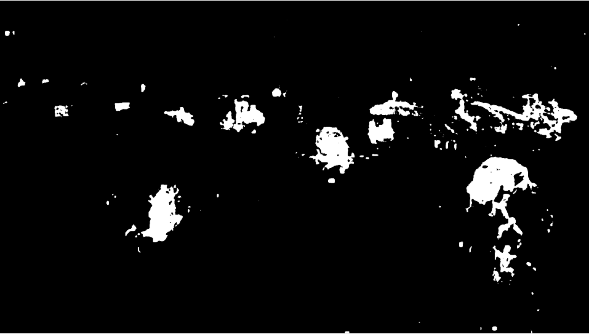
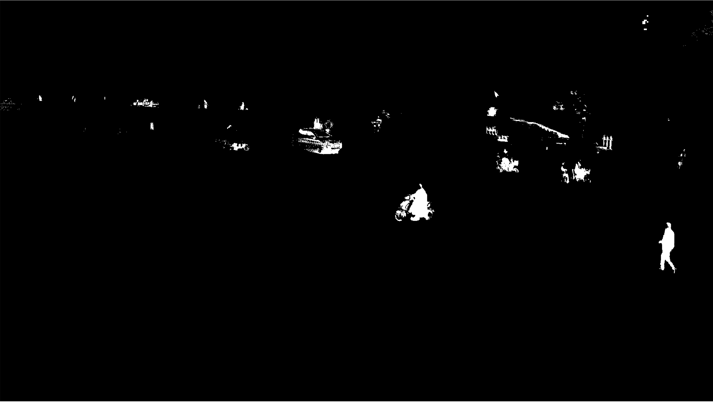
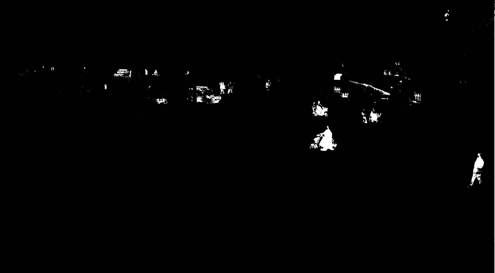
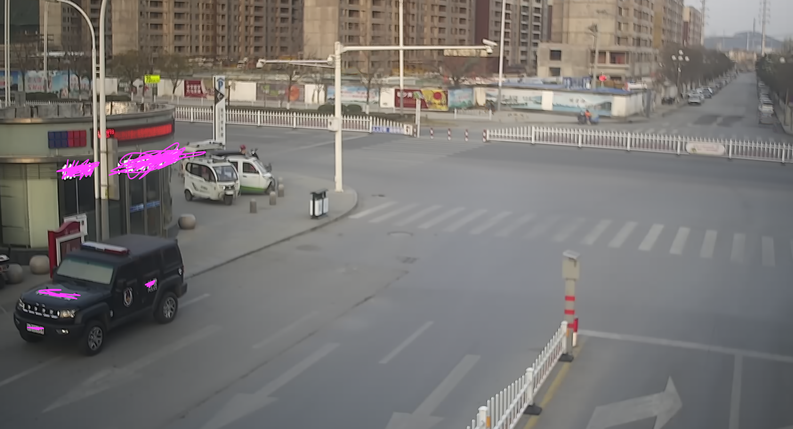
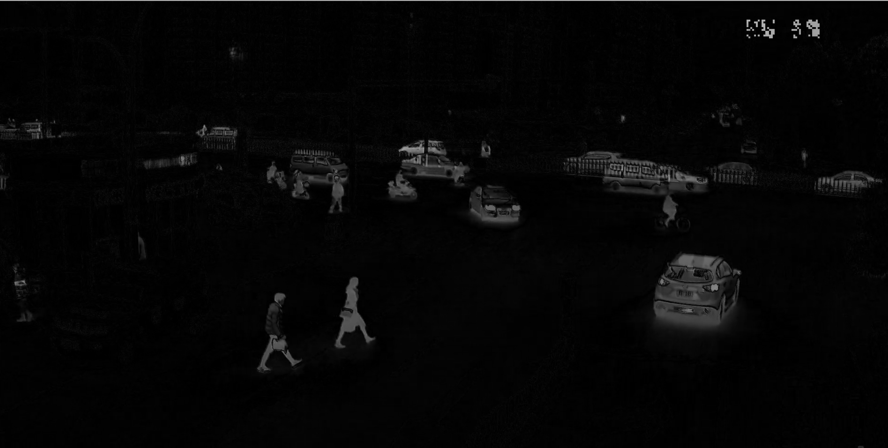

# 背景差

在许多计算机视觉应用中，您可以使用的硬件处理能力很低。在这种情况下，我们必须使用简单而有效的处理技术。背景差在计算机视觉中有广泛的应用。比如使用静态摄像机获取进入或离开交叉路口的车辆的数量的车辆计数器软件。简单的来说，只需从背景中减去新图像即可，这样您就可以获得前景对象。


## GMG背景差法

```python
import numpy as np
import cv2
cap = cv2.VideoCapture('test.avi')
fgbg = cv2.bgsegm.createBackgroundSubtractorGMG()
while(1):
    ret, frame = cap.read()
    fgmask = fgbg.apply(frame)
    cv2.imshow('frame',fgmask)
    k = cv2.waitKey(30) & 0xff
    if k == 27:
        break
cap.release()
cv2.destroyAllWindows()
```



## MOG背景差法

MOG2抗光干扰比较强，比MOG好，一般会用MOG2

```python
import numpy as np
import cv2
cap = cv2.VideoCapture('test.avi')
fgbg = cv2.bgsegm.createBackgroundSubtractorMOG()
while(1):
    ret, frame = cap.read()
    fgmask = fgbg.apply(frame)
    cv2.imshow('frame',fgmask)
    k = cv2.waitKey(30) & 0xff
    if k == 27:
        break
cap.release()
cv2.destroyAllWindows()
```



## MOG2背景差法

```python
import numpy as np
import cv2
cap = cv2.VideoCapture('test.mov')
fgbg = cv2.createBackgroundSubtractorMOG2()
while(1):
    ret, frame = cap.read()
    fgmask = fgbg.apply(frame)
    cv2.imshow('frame',fgmask)
    k = cv2.waitKey(30) & 0xff
    if k == 27:
        break
cap.release()
cv2.destroyAllWindows()
```



## 中位帧参照法

通常情况下背景差法会选取视频第一帧作为参照帧。但在大多数实际应用的情况下，你可能没有一个完美的参照帧数。所以我们在此引入中位帧\(median\)的概念.当按升序或降序排序时，中位数\(median\)是数据的中间值.对于视频来说，我们可以假设大多数时候，每个像素都看到同一块背景，因为静态的相机是没有移动。只有偶尔情况下，汽车或其他移动物体会出现在前方并遮挡背景。因此，我们可以随机采样n帧，计算一个中位帧画面。换句话说，对于每个像素，我们现在有个背景估计值。只要一个像素没有被汽车或其他移动物体覆盖超过50％的时间，根据这些像素的像素的中值，我们可以更好的预估出该像素的背景。

```python
import numpy as np
import cv2
from skimage import data, filters
# 读取视频文件
cap = cv2.VideoCapture('test.mov')
# 随机取25帧的index
frameIds = cap.get(cv2.CAP_PROP_FRAME_COUNT) * np.random.uniform(size=25)
# 取出的图片放入数组中
frames = []
for fid in frameIds:
    cap.set(cv2.CAP_PROP_POS_FRAMES, fid)
    ret, frame = cap.read()
    frames.append(frame)
#按照时间顺序计算中值画面
medianFrame = np.median(frames, axis=0).astype(dtype=np.uint8)    
#展示画面
cv2.imshow('frame', medianFrame)
cv2.waitKey(1)
```



```python
import numpy as np
import cv2
from skimage import data, filters
# 读取视频
cap = cv2.VideoCapture('./test.mov')
# 随机选取n帧视频
frameIds = cap.get(cv2.CAP_PROP_FRAME_COUNT) * np.random.uniform(size=25)
# 存储对应帧数
frames = []
counter=0
for fid in frameIds:
    counter+=1
    print(counter)
    cap.set(cv2.CAP_PROP_POS_FRAMES, fid)
    ret, frame = cap.read()
    frames.append(frame)
#按照时间顺序计算中值画面
medianFrame = np.median(frames, axis=0).astype(dtype=np.uint8)    
#转换为灰度图
grayMedianFrame = cv2.cvtColor(medianFrame, cv2.COLOR_BGR2GRAY)

ret = True
while(ret):
 
  # 读取视频
    ret, frame = cap.read()
  # 转换为灰度图
    frame = cv2.cvtColor(frame, cv2.COLOR_BGR2GRAY)
  # 计算当前帧和中位帧的不同处
    dframe = cv2.absdiff(frame, grayMedianFrame)
  # 过滤低灰度区域
    #th, dframe = cv2.threshold(dframe, 30, 255, cv2.THRESH_BINARY)
  # 展示
    cv2.imshow('frame', dframe)
    cv2.waitKey(1)
cap.release()
cv2.destroyAllWindows()
```



