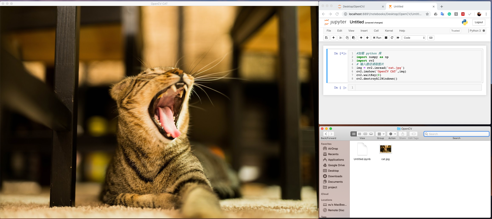
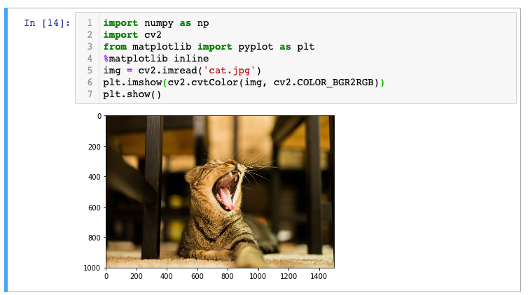

# 图片的读取与展示

## 1.读取图片

* **cv2.imread\(变量1，变量2\)** 是OpenCV 在 Python中读取图片的接口。对应的图片需要放在对应的文件夹下或者输入图片完整的文件路径。第一个变量为读取的文件路径，第二个变量是定义读入图片的类型：


  ```python
  cv2.imread('xx.jpg'，1)#读取彩色图,默认的图片类型
  cv2.imread('xx.jpg'，0)#读取灰度图
  cv2.imread('xx.jpg'，-1)#读取带有透明度（alpha channel)的图片
  ```

以下是读取图片的代码：

```python
#加载 python 库
import numpy as np
import cv2
# 输入路径读取图片
img = cv2.imread('xx.jpg')
```

此时程序只是读入了照片，并不会显示任何图片

## 2.展示图片

### 选项一：opencv自带的接口

* **cv2.imshow\(变量1，变量2\)**  是OpenCV 在 Python中展示图片的接口。一般来说窗口大小或自动匹配图片的大小。它 的第一个变量是定义窗口的名字，第二个变量是之前定义的图片变量。


  ```python
  cv2.imshow('windows name',img)
  ```

* **cv2.waitKey\(变量1\) 的作用是设置对键盘操作的等待时间（毫秒，通常情况下我们会放入0。因为OpenCV中其他的GUI事件也通过这个接口运行，所以即使你必须使用它来展示图片**

  \*\*\*\*

  ```python
  cv2.waitKey(0)
  ```

* **cv2.destroyAllWindows（）的作用是销毁我们之前创建的所有窗口。**
* **cv2.destroyWindow\(\)** **的作用是销毁特定的某个窗口。**
* **cv2.nameWindow\(\)** **的作用是创建一个带名字的窗口，稍后可以放入图片**

  \*\*\*\*

  ```python
  cv2.namedWindow('window Name', cv2.WINDOW_NORMAL)
  ```

以下是展示图片的代码

```python
#加载 python 库
import numpy as np
import cv2
# 输入路径读取图片
img = cv2.imread('xx.jpg')
#定义窗口名字，和需要输出的图片
cv2.imshow('window Name',img)
cv2.waitKey(0)
cv2.destroyAllWindows()
```

### 选项二：使用Matplotlib

除了OpenCv自带的接口外，同时你也可以使用Matplotlib来展示图片\(需要在anaconda中安装Matplotlib）。值得注意的是，OpenCV 会把彩色照片读取为多维度NumPy 数组，但是同时也会逆转颜色顺序。所以如果使用其他库来展示OpenCV读取的图片需要先修正图片颜色属性。

```python
import numpy as np
import cv2
from matplotlib import pyplot as plt
#%matplotlib inline用于定义在juypter notebook中展示matplotlib图片
%matplotlib inline
img = cv2.imread('xx.jpg')
#如果使用matplot需要把图片的展示属性定义为RGB
plt.imshow(cv2.cvtColor(img, cv2.COLOR_BGR2RGB))
plt.show()
```

## 3 .保存图片

* cv2.imwrite\(\)是OpenCV在Python中用来保存图片的接口，第一个变量为保存的文件名，第二个为我们创建的图片变量


  ```python
  cv2.imwrite('xx,jpg',img)
  ```

## 4.案例-展示同一文件路径下的cat.jpg的文件

代码和图片可在此处[下载](https://github.com/ozheng1993/ComputerVisionFromIntroToGiveup/tree/master/source/%20%E5%9B%BE%E7%89%87%E7%9A%84%E5%9F%BA%E6%9C%AC%E6%93%8D%E4%BD%9C)

* 打开Anaconda
* 打开jupyter notebook
* 在照片的同一路径下创建新的python3文件

### 案例一： 使用OpenCV

```python
#加载 python 库
import numpy as np
import cv2
# 输入路径读取图片
img = cv2.imread('cat.jpg')
#定义窗口名字，和需要输出的图片
cv2.imshow('OpenCV CAT',img)
cv2.waitKey(0)
cv2.destroyAllWindows()
```

输出结果：



### 案例二：使用Matplotlib

```python
import numpy as np
import cv2
from matplotlib import pyplot as plt
%matplotlib inline
img = cv2.imread('cat.jpg')
plt.imshow(cv2.cvtColor(img, cv2.COLOR_BGR2RGB))
plt.show()
```



