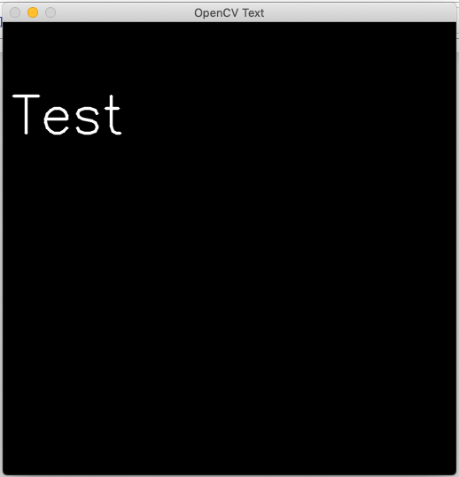
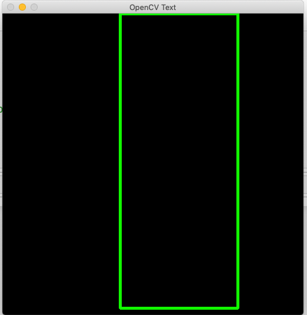
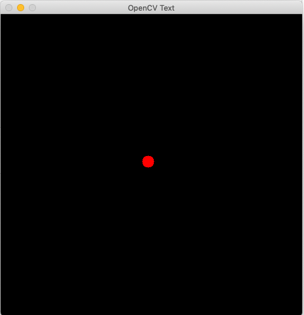
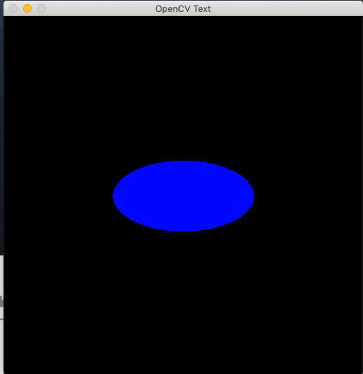
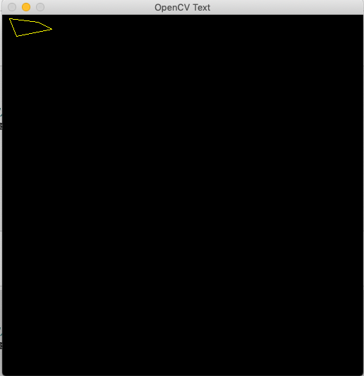

# 基本的画图操作

## 1.文字

cv2.putText\(图片，“文字内容“，文字坐标，字体，字体大小，字体颜色，字体粗细，字体类别）

```python
cv2.putText(img,'OpenCV',(10,500), cv2.FONT_HERSHEY_SIMPLE, 4,(255,255,255),2,cv2.LINE_AA)
```

### 案例：

```python
import numpy as np
import cv2

# 创建一个512X512的纯黑色背景的图片
img = np.zeros((512,512,3), np.uint8)

# 写一段话
cv2.putText(img,'Test',(10,125), cv2.FONT_HERSHEY_SIMPLEX, 2,(255,255,255),2,cv2.LINE_AA)

#加载 python 库
#定义窗口名字，和需要输出的图片
cv2.imshow('OpenCV CAT',img)
cv2.waitKey(0)
cv2.destroyAllWindows()
```

### 输出



## 3.四边形

cv2.rectangle\(图片，四边形左上角坐标，四边形右下角坐标，颜色，线条粗细）

```python
cv2.rectangle(img,(200,0),(400,500),(0,255,0),3)
```

### 案例

```python
import numpy as np
import cv2

# 创建一个512X512的纯黑色背景的图片
img = np.zeros((512,512,3), np.uint8)

# 画一个四边形
cv2.rectangle(img,(200,0),(400,500),(0,255,0),3)
#加载 python 库
#定义窗口名字，和需要输出的图片
cv2.imshow('OpenCV Text',img)
cv2.waitKey(0)
cv2.destroyAllWindows()
```

### 输出



## 4.圆形

cv2.circle\(图片，圆心坐标，圆半径，颜色，是否填充（-1为填充））

```python
cv2.circle(img,(447,63), 63, (0,0,255), -1)
```

### 案例

```python
import numpy as np
import cv2

# 创建一个512X512的纯黑色背景的图片
img = np.zeros((512,512,3), np.uint8)

# 画一个圆形
cv2.circle(img,(250,250), 10, (0,0,255), -1)
#加载 python 库
#定义窗口名字，和需要输出的图片
cv2.imshow('OpenCV Text',img)
cv2.waitKey(0)
cv2.destroyAllWindows()
```

### 输出



## 5. 椭圆形

cv2.ellipse\(图片，中心点坐标，长和宽，旋转角度，起始角度，终止角度，透明度，是否填充（-1 为填充））

* 长和宽：长轴和短轴
* 旋转角度：逆时针方向旋转的度数
* 起始角度：填充起始的度数
* 终止角度：填充终止的度数
* 透明度：0-255 定义透明度

```python
cv2.ellipse(img,(256,256),(100,50),0,0,180,255,-1)
```

### 案例：

```python
import numpy as np
import cv2

# 创建一个512X512的纯黑色背景的图片
img = np.zeros((512,512,3), np.uint8)

# 画一个椭圆形
cv2.ellipse(img,(256,256),(100,50),0,0,360,255,-1)
#加载 python 库
#定义窗口名字，和需要输出的图片
cv2.imshow('OpenCV Text',img)
cv2.waitKey(0)
cv2.destroyAllWindows()
```

### 输出



## 6.多边形

cv2.polines\(图片，顶点数组，是否闭合，填充颜色）

```python
pts = np.array([[10,5],[20,30],[70,20],[50,10]], np.int32)
pts = pts.reshape((-1,1,2))
cv2.polylines(img,[pts],True,(0,255,255))
```

### 案例

```python
import numpy as np
import cv2

# 创建一个512X512的纯黑色背景的图片
img = np.zeros((512,512,3), np.uint8)


#定义顶点
pts = np.array([[10,5],[20,30],[70,20],[50,10]], np.int32)
#转换为ROWSx1x2数组
pts = pts.reshape((-1,1,2))
# 画一个多边形
img = cv2.polylines(img,[pts],True,(0,255,255))
#加载 python 库
#定义窗口名字，和需要输出的图片
cv2.imshow('OpenCV Text',img)
cv2.waitKey(0)
cv2.destroyAllWindows()
```

### 输出



## [代码下载](https://github.com/ozheng1993/ComputerVisionFromIntroToGiveup/tree/master/source/%E5%9F%BA%E6%9C%AC%E7%9A%84%E7%94%BB%E5%9B%BE%E6%93%8D%E4%BD%9C)


