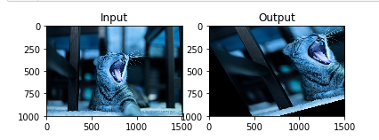
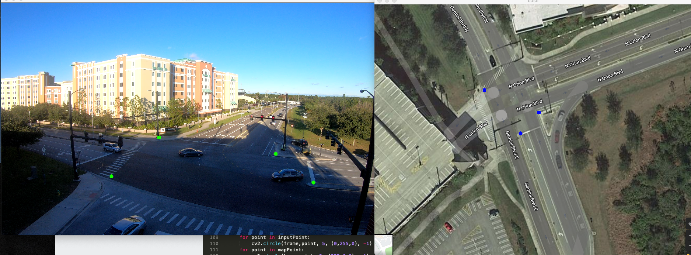
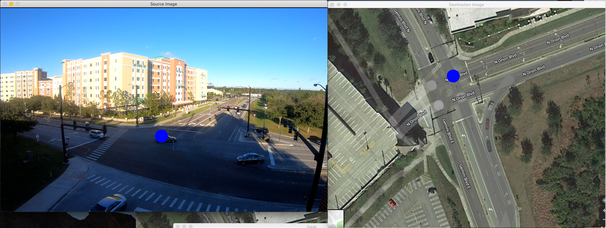

# 图像的几何变换

## 缩放（scaling）

基本上缩放就是重新定义图片的大小.

cv2.resize\(图片，none，x轴缩放倍数，y轴缩放倍数，缩放类型\)

缩放类型：

cv2.INTER\_CUBIC（放大缩小，计算复杂，慢）

cv2.INTER\_AREA（推荐缩小使用）

cv2.INTER\_LINEAR\(通用缩放\)

代码：

```python
import cv2
import numpy as np

img = cv2.imread('cat.jpg')
#放大1.5倍
img2 = cv2.resize(img,None,fx=1.5, fy=1.5, interpolation = cv2.INTER_CUBIC)

# #OR

# height, width = img.shape[:2]
# res = cv2.resize(img,(2*width, 2*height), interpolation = cv2.INTER_CUBIC)

cv2.imshow('Input',img)
cv2.imshow('Output',img2)
cv2.waitKey(0)
cv2.destroyAllWindows()
```


## 位移（translation）

图片像某一方向移动移动距离

OpenCv通过计算2x3 的`np.float32` 的m矩阵（tx为x轴运动方向和距离（正数为向右，负数向左），ty为y轴运动距离和方向（正数为向右，负数向左）


代码：

```python
import cv2
import numpy as np

img = cv2.imread('cat.jpg',1)
#读取图片大小信息
rows,cols = img.shape[:2]
#定义M矩阵（位移方向和距离信息），以下为向x轴方向移动100像素点，再向y轴方向移动50个像素点
M = np.float32([[1,0,100],[0,1,50]])
#应用m矩阵到原图像
dst = cv2.warpAffine(img,M,(cols,rows))

cv2.imshow('beforeImg',img)
cv2.imshow('afterimg',dst)
cv2.waitKey(0)
cv2.destroyAllWindows()
```

输出：


## 旋转（rotation）

openCV通过应用2x2的M矩阵到原始图像实现旋转


OpenCV 同时也提供缩放旋转功能，并且你可以自定义旋转中心


cv2.getRotationMatrix2D\(\(长,宽\),旋转角度,1\) 

代码：

```python
import cv2
import numpy as np
#读取图片
img = cv2.imread('cat.jpg',1)
#读取图片大小信息
rows,cols = img.shape[:2]
#创建旋转矩阵
M = cv2.getRotationMatrix2D((cols/2,rows/2),90,1)
#应用到原图像
dst = cv2.warpAffine(img,M,(cols,rows))
#显示
cv2.imshow('beforeImg',img)
cv2.imshow('afterimg',dst)
cv2.waitKey(0)
cv2.destroyAllWindows()
```

输出：


## 仿射变换（affine transformation）

仿射变换是指在向量空间中对图像进行一次线性变换\(乘以一个矩阵\)并加上一个平移\(加上一个向量\)，使其变换为另一个向量空间的过程。通常用于图像矫正

```python
import cv2
import numpy as np
from matplotlib import pyplot as plt
%matplotlib inline
#读取图片
img = cv2.imread('cat.jpg',1)
#读取图片大小信息
rows,cols = img.shape[:2]
#定义原图像中的参照点
pts1 = np.float32([[50,50],[200,50],[50,200]])
#定义原图像中的参照点在新图像中的位置
pts2 = np.float32([[10,100],[200,50],[100,250]])
#计算出仿射矩阵
M = cv2.getAffineTransform(pts1,pts2)
#应用到原图像
dst = cv2.warpAffine(img,M,(cols,rows))

plt.subplot(121),plt.imshow(img),plt.title('Input')
plt.subplot(122),plt.imshow(dst),plt.title('Output')
plt.show()
```



## 透视变换（Perspective Transformation）

透视变换是将图像投影到一个新的视平面

```python
import cv2
import numpy as np
from matplotlib import pyplot as plt
%matplotlib inline
#读取图片
img = cv2.imread('cat_pt.jpg',1)
#读取图片大小信息
rows,cols = img.shape[:2]
#选取原图中需要被转换物体的四个顶点
pts1 = np.float32([[550,500],[3400,590],[280,3870],[3890,3500]])
#设置在新图像中原图像的四个顶点的位置
pts2 = np.float32([[0,0],[3000,0],[0,3000],[3000,3000]])
#计算转换M矩阵
M = cv2.getPerspectiveTransform(pts1,pts2)
#应用M矩阵到原图像
dst = cv2.warpPerspective(img,M,(3000,2000))

plt.subplot(121),plt.imshow(img),plt.title('Input')
plt.subplot(122),plt.imshow(dst),plt.title('Output')
plt.show()
```


## 单应性变换（Homography Tranformation）

在两张图分别标记四个相对位置相同的点，将一张图中的点映射到另一张图中对应的点的矩阵就是就是一个变换Homography M 矩阵（3\*3）

h, status = cv2.findHomography\(第一张图中四个点, 第二张图中四个点\)

代码：

```python
import cv2
import numpy as np
# Read source image.
%matplotlib inline
#读取图片
img = cv2.imread('test.png',1)

# 定义原图中的四个点
pts_src = np.array([[428, 367], [745, 412], [847, 490],[299, 473]])
 
# 读取第二张图片
im_dst = cv2.imread('base.png')
#  定义原图中的四个点在第二张图片中对应的位置
pts_dst = np.array([[404, 134],[447, 294],[398, 352],[299, 233]])
 
# 计算单应性矩阵h
h, status = cv2.findHomography(pts_src, pts_dst)
#-----------------------------------------验证H 矩阵---------------
#在原图中定义一个点
inputX=500
inputY=400

#转换这个点坐标为np数组
newPoint=np.array([inputX,inputY,1],np.float32)
#计算应用矩阵后的点坐标矩阵
newpoinMatrix = h.dot(newPoint)
#新坐标点矩阵转换为2d坐标
outputX=newpoinMatrix[0]/newpoinMatrix[2]
outputY=newpoinMatrix[1]/newpoinMatrix[2]

#在两幅图中标记两点
cv2.circle(im_dst,(int(outputX),int(outputY)), 20, (255,0,0), -1)
cv2.circle(img,(inputX,inputY), 20, (255,0,0), -1)
# Display images
cv2.imshow("Source Image", img)
cv2.imshow("Destination Image", im_dst)
cv2.waitKey(0)
cv2.destroyAllWindows()
```



输出：




