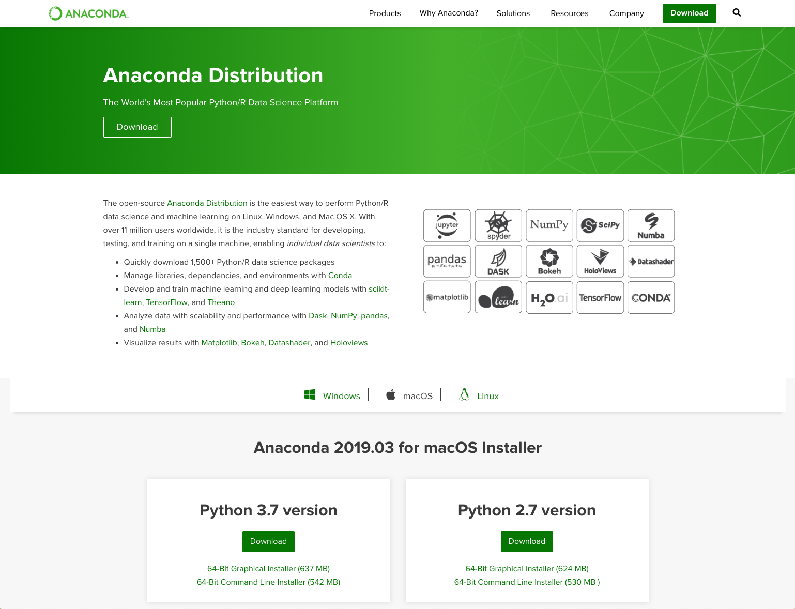
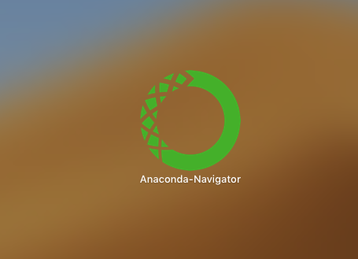
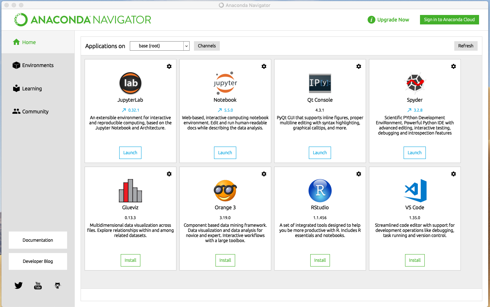
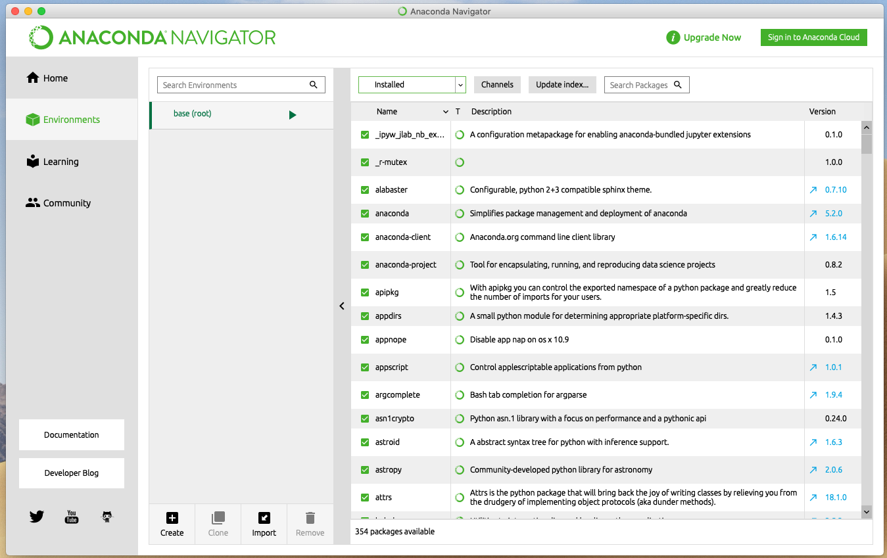
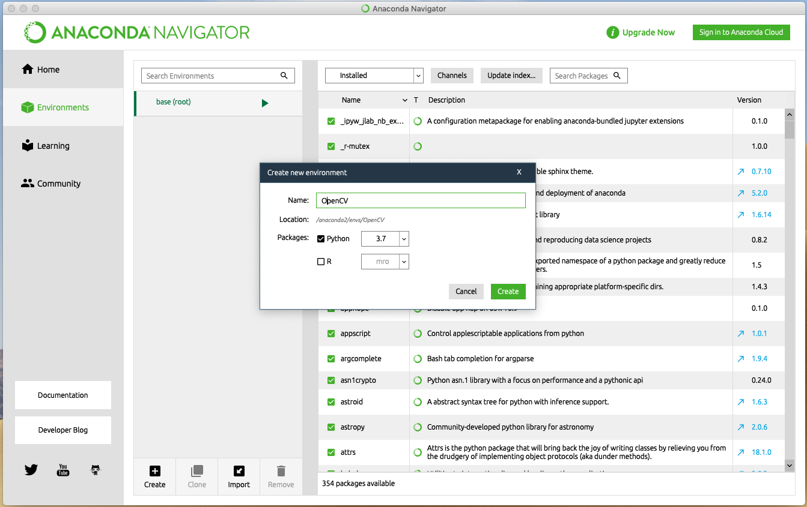
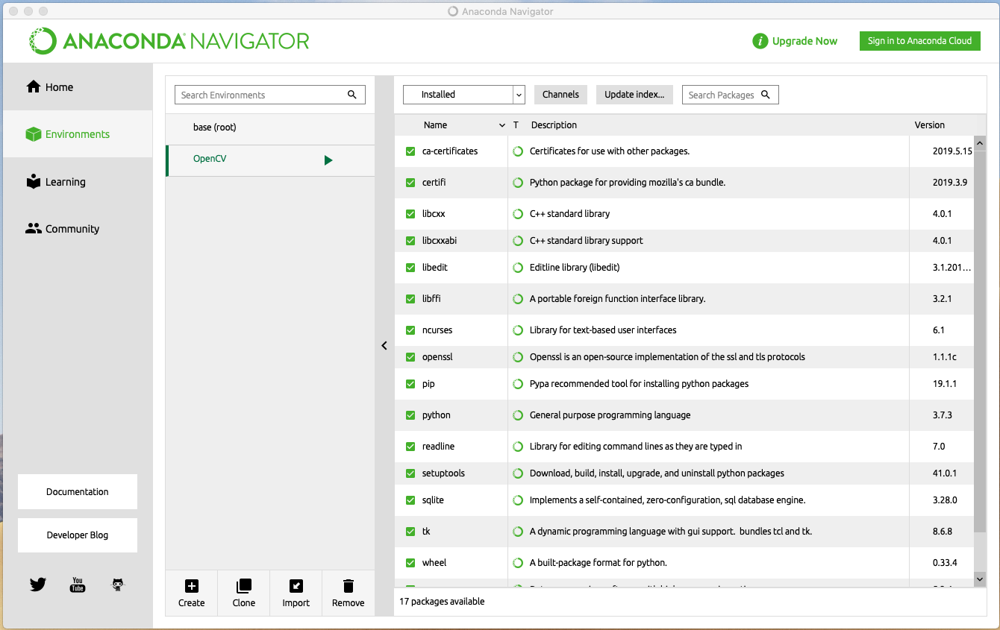

# 安装-Anaconda

## 安装ython虚拟环境

### 第一步：下载Anaconda

进入Anaconda官网，下载对应操作系统的naconda版本（在此我们推荐下载Python 3.7 版本）

```
https://www.anaconda.com/distribution/
```



### 第二步：配置Python 虚拟环境

Mac OS/Windows 在下载安装完成后你将会看到如下图标，双击打开 即可



Linux 用户需要到命令行（Terminal）中输入一下指令来打开naconda

```bash
sudo anaconda-navigator
```

如果一切顺利你将会看到如下界面



双击右侧Environments 选项



点击下方Create按钮，输入自己喜欢的环境命名后选择Python 3.7。完成后点击绿色Create图标



等待几分钟后，你会在右侧的环境列表中看到你刚刚创建的环境



