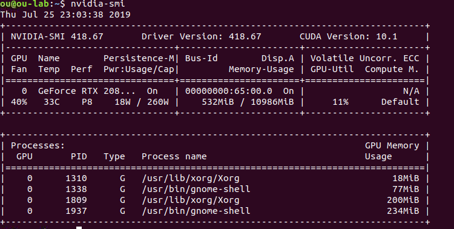

# 安装-CUDA

## 1.需求

NVIDIA® 显卡 card with CUDA® Compute Capability 3.5 or higher.

### 2.安装-ubuntu 18.04\(cuda 10\)

在命令行输入下面代码

```bash
# 加入nvidia源
wget https://developer.download.nvidia.com/compute/cuda/repos/ubuntu1804/x86_64/cuda-repo-ubuntu1804_10.0.130-1_amd64.deb
sudo dpkg -i cuda-repo-ubuntu1804_10.0.130-1_amd64.deb
sudo apt-key adv --fetch-keys https://developer.download.nvidia.com/compute/cuda/repos/ubuntu1804/x86_64/7fa2af80.pub
sudo apt-get update
wget http://developer.download.nvidia.com/compute/machine-learning/repos/ubuntu1804/x86_64/nvidia-machine-learning-repo-ubuntu1804_1.0.0-1_amd64.deb
sudo apt install ./nvidia-machine-learning-repo-ubuntu1804_1.0.0-1_amd64.deb
sudo apt-get update

# 装显卡驱动
sudo apt-get install --no-install-recommends nvidia-driver-418
# 重启

```

在命令行输入nvidia-smi验证显卡驱动如果安装成功则会看到如下界面



```bash
# 装cuda
sudo apt-get install --no-install-recommends \
    cuda-10-0 \
    libcudnn7=7.6.0.64-1+cuda10.0  \
    libcudnn7-dev=7.6.0.64-1+cuda10.0
```

## 验证安装

```python
import tensorflow as tf 
tf.test.is_gpu_available( cuda_only=False, min_cuda_compute_capability=None )
```

返回为True 则为安装成功

