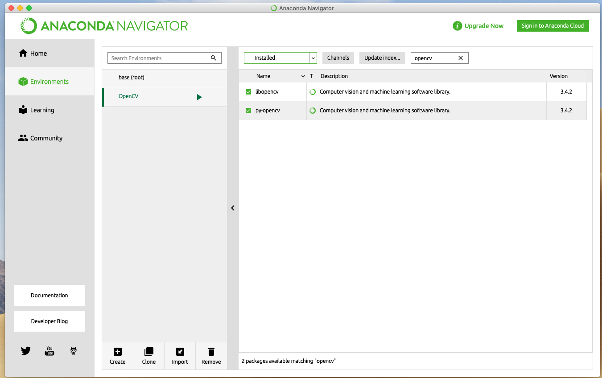
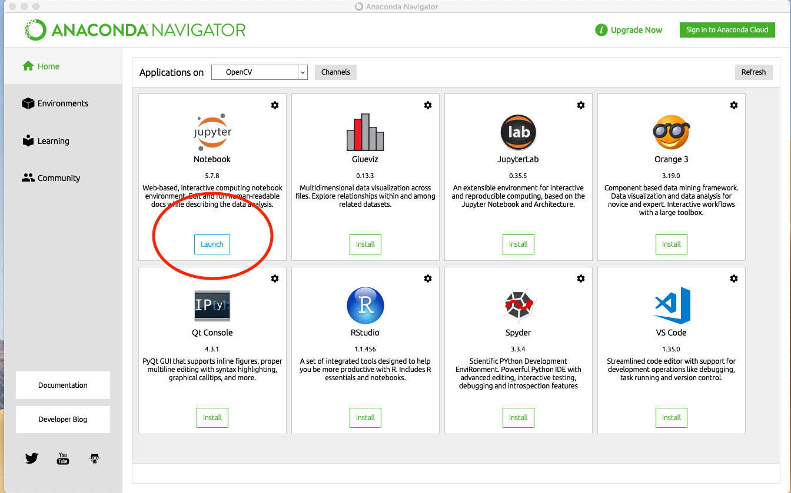
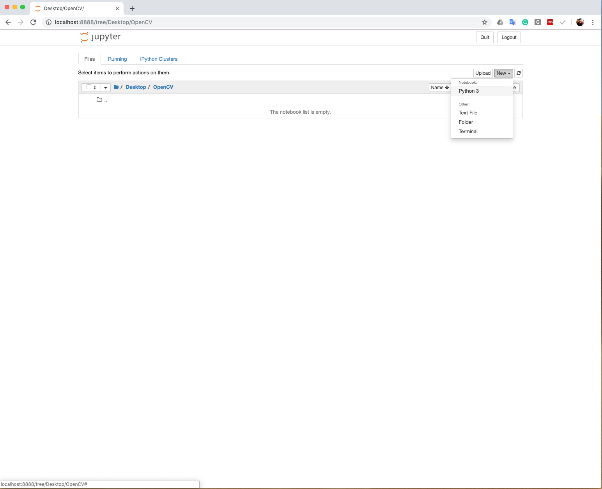

# 安装-验证

安装完成后，右侧的复选框会呈现被选中状态



### 

此时我们可以双击左侧Home按钮回到主界面，在双击Jupyter Notebook（没有安装的双击install即可安装）。



在Jupyter notebook中导航到你希望存放文件的文件夹，双击右上角New按钮创建新的python 3文件



双击进入刚刚创建的Python 3文件，输入一下代码

```python
import cv2
cv2.__version__
```

如果获得和下图一样的输出，即可证明OpenCV已安装成功


